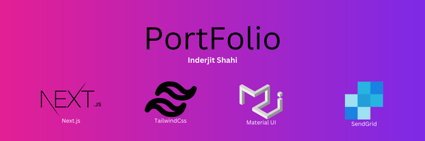

# Portfolio built with Next JS 12+, React.js, Tailwind CSS, Sendgrid,and  MUI [](https://www.linkedin.com/in/inderjit-shahi-b9880a201/)

<p align="center">
  <a href="https://port-folio-vxwv.vercel.app/"></a>
</p>

🚀 Portfolio, the doc editor created in Next.js, ⚡️ Made with developer experience first: Next.js, React.js, Sendgrid, VSCode, Vercel, Material UI.


### DEMO

[](https://port-folio-vxwv.vercel.app/)

Check out [live demo](https://port-folio-vxwv.vercel.app/).

### Features

Developer experience first:

- 🔥 [Next.js](https://nextjs.org) for Static Site Generator
- 📝 [Sendgrid](https://sendgrid.com/) Integration
- 🎨 Integrate with [Material UI](https://tailwindcss.com)
- 🤖 SEO metadata, JSON-LD and Open Graph tags with Next SEO
- ✅ Strict Mode for  React 17
- 🗂 VSCode configuration: Debug, Settings, Tasks and extension for PostCSS,Prettier
- ⚙️ [Bundler Analyzer](https://www.npmjs.com/package/@next/bundle-analyzer)
- 🖱️ One click deployment with Vercel
Built-in feature from Next.js:

- ☕ Minify HTML & CSS
- 💨 Live reload
- ✅ Sessions

### Included Components

- Navbar
- About Me
- Resume
- Contact Me
- Footer

Find more Projects at [Github Page](https://github.com/inderjitshahi).

### Philosophy

- Minimal code
- SEO-friendly
- 🚀 Production-ready


### Requirements

- Node.js and npm

### Getting started

Run the following command on your local environment:

```
git clone --depth=1 https://github.com/inderjitshahi/portfolio my-project-name
cd my-project-name
npm install
```

Then, you can run locally in development mode with live reload:

```
npm run dev
```

Open http://localhost:3000 with your favorite browser to see your project. For your information, Next JS need to take some time to compile the project for your first time.

```
.
├── README.md            # README file
├── public               # Public folder
│   └── images           # Image used by Website
│           
├──components
│   ├── Header.js        # Header Component
│   ├── Resume.js        # Resume Component
│   ├── AboutMe.js       # About Me Component
│   ├── Contact.js       # Contact Page
│   └── Footer.js        # Footer Component
├──pages
│   ├── index.js         # '/' page of the web
│   └── _app.js          # file for global css import
├── styles               # Public folder
│   └── global           # Global styles to the website
└── next.config.js       # Next JS configuration
```

### Deploy to production

You can see the results locally in production mode with:

```
$ npm run build
$ npm run start
```

The generated HTML and CSS files are minified (built-in feature from Next js). It will also removed unused CSS from [Tailwind CSS](https://tailwindcss.com).

You can create an optimized production build with:

```
npm run build-prod
```

Now, your theme is ready to be deployed. All generated files are located at `out` folder, which you can deploy with any hosting service.

### Deploy to Netlify

Clone this repository on own GitHub account and deploy to Netlify:

[](https://app.netlify.com/start/deploy?repository=https://github.com/ixartz/Next-JS-Landing-Page-Starter-Template)

### Deploy to Vercel

Deploy this Next JS Boilerplate on Vercel in one click:

[](https://vercel.com/new/git/external?repository-url=https%3A%2F%2Fgithub.com%2Fixartz%2FNext-JS-Landing-Page-Starter-Template)

### VSCode information (optional)

If you are VSCode users, you can have a better integration with VSCode by installing the suggested extension in `.vscode/extension.json`. The starter code comes up with Settings for a seamless integration with VSCode. The Debug configuration is also provided for frontend and backend debugging experience.

Pro tips: if you need a project wide type checking with TypeScript, you can run a build with <kbd>Cmd</kbd> + <kbd>Shift</kbd> + <kbd>B</kbd> on Mac.

### Contributions

Everyone is welcome to contribute to this project. Feel free to open an issue if you have question or found a bug.

### License

Licensed under the MIT License, Copyright © 2022

See [LICENSE](LICENSE) for more information.

---

Made with ♥ by [Inderjit Shahi](https://port-folio-vxwv.vercel.app/) [](https://www.linkedin.com/in/inderjit-shahi-b9880a201/)
